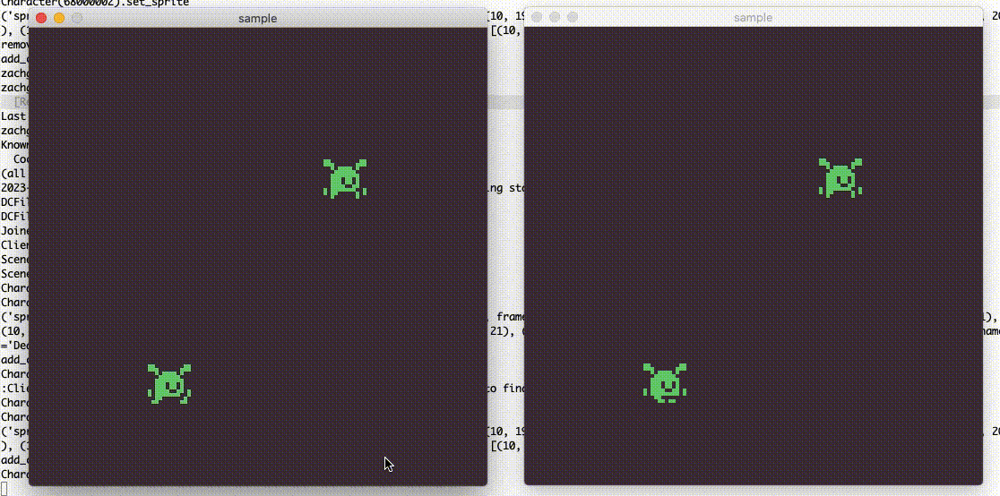

# burst

A framework for building distributed 2D games from sprite sheets.

---

Launch a server:

```
cd burst
python -m burst.ai --dclass tests/sample/dclass/sample.dc
```

Launch a client:

```
cd burst
python -m tests.sample
```


